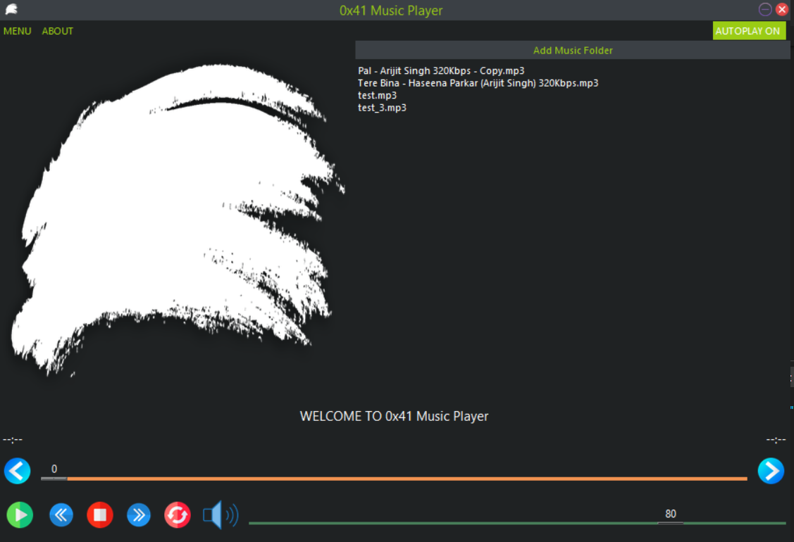

# 0x41-MEDIA-PLAYER
Just a 1st sem Python Project

Project is available on : <i>https://github.com/Arijit-Bhowmick/0x41-MEDIA-PLAYER</i>



# USAGE

Run ``` python3 setup.py ``` at first to install the required modules<br>
or install them manually which are listed in the "requirements.txt" file <br><br>

Linux based system requires, root privilages to install some modules:<br>
Here it is: <b>Tkinter</b>, and <b>Pillow</b><br><br>

In case of Windows OS, Tkinter is already installed during the installation<br>
of the python package.<br>

After Setting up the modules you can run ``` python3 0x41-music-player.py ```<br>
to launch the Music Player.<br>


## Tested Systems

Windows 10 Pro (64-bit)
Linux Mint 20.1 "Ulyssa" - Xfce (64-bit)

# SUPPORT THIS PROJECT

## Do you want to provide support ?

Then you can do so from <a href="https://arijit-bhowmick.github.io/supportive_webpages/support.html">here</a>